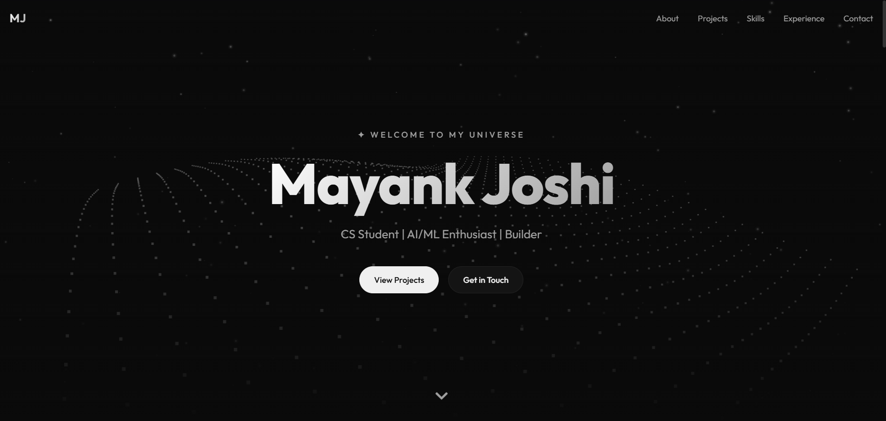
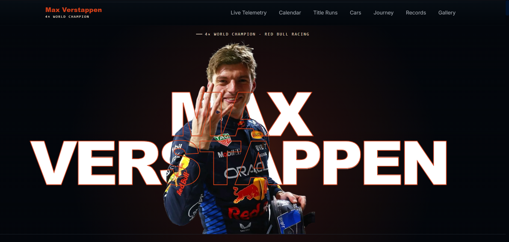

<h1 align="center">Hi, I'm Mayank Joshi</h1>

<h3 align="center">
Computer Science Undergraduate | Full-Stack Developer | Python Developer
</h3>

I enjoy building practical software, exploring cybersecurity, and developing data-driven applications. This profile showcases my personal projects, hackathon submissions, and technical learning journey.

  

---

## About

I am a Computer Science undergraduate interested in software development, cybersecurity, and data-driven applications. My GitHub profile contains personal projects, hackathon submissions, and academic work completed as part of my learning journey. I enjoy building practical software, exploring modern technologies, and continuously improving my understanding of secure and scalable software engineering.

## Connect

---

## Tech Stack

### Languages

### Frontend

### Backend

### AI / Machine Learning

TensorFlow • Scikit-learn • Pandas • NumPy • Computer Vision • AI Agents

### Databases

### Tools & Platforms

Claude Code • OpenClaw

---

## Featured Projects

<table>
<tr>

<td width="50%" valign="top">

### Personal Website

A personal portfolio website showcasing my projects, technical skills, and development journey.

 

</td>

<td width="50%" valign="top">

### Max Verstappen

A modern Formula 1 website featuring race information, statistics, and analytics dedicated to Max Verstappen.

 

</td>

</tr>

<tr>

<td width="50%" valign="top">

### VULSCAN

A cybersecurity platform focused on vulnerability scanning, security analysis, and secure software development practices.

 

</td>

<td width="50%" valign="top">

### AI Cat & Dog Classifier

A TensorFlow-based deep learning project that trains a convolutional neural network to classify cat and dog images.

 

</td>

</tr>
</table>

---

## GitHub Statistics

---

## Contribution Graph

---

<i>"Building software, learning continuously, and solving real-world problems through technology."</i>

